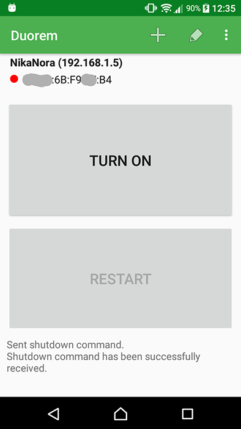

Duorem
======

This is an Android app that allows you to power off and on a remote computer. It appeared because my wife wanted an easy way to control media home computer at home, something not geeky. :)

<a href="https://f-droid.org/packages/com.vadimfrolov.duorem/" target="_blank">
</a>

Wake On Lan (WOL) technology is used to wake up a remote computer. You might need to do additional configuration of your network and remote computer before you can use it. Note also that WOL works reliably if your remote computer is connected to router/Internet via cable, i.e. not WiFi.

In order to power off and reboot a remote computer, a secure shell Linux command (SSH) is used. Your computer needs an SSH server, password authentication, and permission to run the configured shutdown command. By default, Duorem runs `sudo shutdown -h now` or `sudo shutdown -r now`, using the SSH password for sudo. A custom shutdown command can be entered under Advanced details. SSH-key authentication and a separate sudo password are not supported.

Saved settings, including the SSH password, are encrypted using AES-GCM with a key held in Android Keystore. Existing plaintext settings are migrated in place on first launch, preserving the device, ports, credentials, broadcast address and custom command. Migration errors are reported without overwriting the saved data. Credentials and trusted SSH host keys are excluded from cloud backup and device transfer; configure the device again after reinstalling or moving phones.

Before the first SSH command, verify the displayed SHA-256 host-key fingerprint directly on the remote computer (for example, `ssh-keygen -lf /etc/ssh/ssh_host_ed25519_key.pub`). Duorem requires explicit confirmation for new or changed keys before authenticating or sending a command. It does not enable obsolete SSH algorithms automatically.

Android modernization
---------------------

The app supports **Android 10 (API 29) and newer** and compiles/targets **Android 17 (API 37)**. This is an incremental Java/XML migration, not a UI rewrite. The application ID is unchanged; an update signed with the original signing key retains installed settings.

| Area | Previous implementation | Updated implementation |
| --- | --- | --- |
| Build | AGP 3.5, Gradle 5.4, JCenter, target API 25 | AGP 9.4.1, Gradle 9.6, Google Maven/Maven Central, target API 37 |
| UI/platform | Android support libraries | AndroidX/Material, system light/dark theme, system-bar/keyboard insets, explicit exported activities |
| Networking | Connectivity broadcasts, Wi-Fi DHCP APIs, shell commands | Network callbacks and LinkProperties; sockets bound to the selected network |
| Background work | AsyncTask, unbounded socket waits, polling socket on the UI thread | Cancellable executors, connection/command deadlines, foreground-only polling |
| Discovery | Required reverse DNS and readable ARP entries | Reachability/SSH probes, NetBIOS MAC lookup, and optional root-assisted neighbor lookup |
| Storage/SSH | Plaintext preferences and unchecked host keys | Keystore-backed encryption with legacy migration; explicit host-key verification |

### Behavior and platform limits

- Wake-on-LAN works independently of SSH: only a MAC address and WOL destination/port are needed. An unset broadcast address uses the current IPv4 network's broadcast address; an explicitly configured address is preserved.
- The interface follows the system light or dark theme, including menus, dialogs, forms, and system bars.
- On Android 17+, use **Allow local network access** to grant permission. Denial leaves manual configuration available; discovery, polling, WOL and SSH do not run until permission is granted. After permanent denial, the same action opens the app's system settings.
- Discovery uses the connected IPv4 subnet, preferring Wi-Fi/Ethernet even without Internet access. It probes SSH port 22 and ICMP, skips the phone and gateway, and uses ten workers rather than queuing the entire subnet. Large subnets take longer; leaving the discovery screen cancels the scan. Firewalls or nonstandard SSH ports can make a host undiscoverable; use manual configuration.
- Android 10+ blocks ordinary apps from reading `/proc/net/arp`. Duorem first tries a NetBIOS node-status query, which works only for devices that support it. On a rooted phone, **Use root for MAC lookup** can be enabled from the discovery menu; it is disabled by default and invokes `su` only after NetBIOS fails. If root is unavailable, denied, or times out, the option disables itself. Otherwise, enter the computer's wired MAC address from its settings or router.
- The status indicator checks both device reachability and the configured SSH port every five seconds while the main screen is visible. It distinguishes **Online · SSH ready**, **Online · SSH unavailable/not configured**, and **Unreachable**. Shutdown and restart require SSH readiness; Wake-on-LAN is offered when the device is unreachable.
- Leaving the main screen cancels local network work. A command already delivered to the remote computer may still execute. SSH success requires a zero exit status; a disconnect without an exit status is reported as an unknown outcome, not success. A sent WOL datagram does not prove the computer woke up.
- Phone, landscape/tablet layouts and TV launcher support are retained. Existing translations are retained and new messages are provided in the same languages.

Platform references: [Android 17 local-network permission](https://developer.android.com/privacy-and-security/local-network-permission), [Android 10 network filesystem restrictions](https://developer.android.com/about/versions/10/privacy/changes#proc-net-filesystem), [edge-to-edge layouts](https://developer.android.com/develop/ui/views/layout/edge-to-edge), and [Android Keystore](https://developer.android.com/privacy-and-security/keystore).

Screenshots
-----------

You can find app screenshots in `screenshots` folder. Here is the main screen:


Build
-----

- Use Android Studio with AGP 9.4 support, or a JDK supported by Gradle 9.6 (minimum JDK 17).
- Install Android SDK Platform 37 and Build Tools 36.0.0 using SDK Manager.
- Set `JAVA_HOME` to the JDK and `ANDROID_HOME` to the SDK, or set `sdk.dir` in your untracked `local.properties`. The Java 8 runtime used by the old project cannot run this build. Android Studio's bundled JBR can be used.
- Build with the checked-in wrapper; no system Gradle installation is needed:

```powershell
.\gradlew.bat :app:assembleDebug :app:testDebugUnitTest :app:lintDebug
.\gradlew.bat :app:bundleRelease
```

On macOS/Linux use `./gradlew` instead. The debug APK is `app/build/outputs/apk/debug/app-debug.apk`; the release bundle is `app/build/outputs/bundle/release/app-release.aab`. Release signing is deliberately not configured: use your existing signing key for distribution, and never commit it.

### Verification

JVM tests cover unsigned IPv4/subnet boundaries, NetBIOS and root-neighbor response parsing, input validation, legacy settings compatibility, exact 102-byte magic-packet contents, and a real loopback UDP send with no SSH configuration. Instrumented tests cover Keystore migration, deletion/corruption handling, and the main-screen controls.

With a dedicated emulator or test device connected:

```powershell
.\gradlew.bat :app:connectedDebugAndroidTest
```

Before distributing, exercise API 29 and API 37, permission grant/denial/revocation, editing across rotation/process recreation, phone/tablet/TV navigation, a LAN without Internet, and Wi-Fi reconnects. Verify NetBIOS discovery, optional root lookup on a dedicated rooted device, WOL, SSH host-key confirmation/change rejection, shutdown and reboot against a computer you control. An emulator alone cannot prove that a physical computer supports Wake-on-LAN.

Acknowledgment
--------------

- Network discovery part of the app is based on [Network Discovery](https://github.com/rorist/android-network-discovery) app.
- The maintained [mwiede/JSch](https://github.com/mwiede/jsch) fork is used for SSH, with Bouncy Castle supplying modern algorithms on older Android runtimes.
- Japanese translation provided by [naofum](https://github.com/naofum).

Todo
----

- Add RecyclerView list item selection. This might be useful on tablets, when user can see the list and configuration dialog at the same time.
- Widget support. Might be even easier to have two buttons as a widget. However, I constantly poll the target, so it is a potential battery drain.

GPLv3 License
-------

    Copyright (C) 2009-2011 Aubort Jean-Baptiste (Rorist)
    Copyright (C) 2017 Vadim Frolov

    This program is free software: you can redistribute it and/or modify
    it under the terms of the GNU General Public License as published by
    the Free Software Foundation, either version 3 of the License, or
    (at your option) any later version.

    This program is distributed in the hope that it will be useful,
    but WITHOUT ANY WARRANTY; without even the implied warranty of
    MERCHANTABILITY or FITNESS FOR A PARTICULAR PURPOSE.  See the
    GNU General Public License for more details.

    You should have received a copy of the GNU General Public License
    along with this program.  If not, see <http://www.gnu.org/licenses/>.

Copy of the license can be found in gpl-3.0.txt
